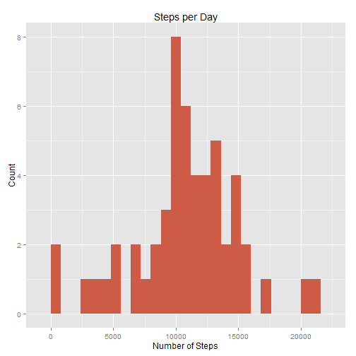
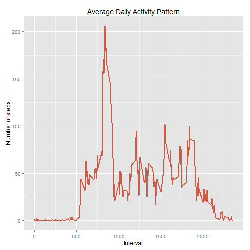

# Reproducible Research: Peer Assessment 1
####*Matyas Theuer*


This document is my solution to Peer Assignment 1 of course [Reproducible Research](https://class.coursera.org/repdata-036) on [Coursera](https://www.coursera.org). 

This assignment makes use of data from a personal activity monitoring device.
This device collects data at 5 minute intervals through out the day. The data
consists of two months of data from an anonymous individual collected during
the months of October and November, 2012 and include the number of steps
taken in 5 minute intervals each day.

### Dataset

The data for this assignment can be downloaded from the course web site: 

* Dataset: [Activity monitoring data](https://d396qusza40orc.cloudfront.net/repdata%2Fdata%2Factivity.zip) [52K]

The variables included in this dataset are:

* steps: Number of steps taking in a 5-minute interval (missing values are coded as NA)

* date: The date on which the measurement was taken in YYYY-MM-DD format

* interval: Identifier for the 5-minute interval in which measurement was taken

The dataset is stored in a comma-separated-value (CSV) file and there are a total of 17,568 observations in this dataset.

### Prepare environment


```r
library(knitr)
library(ggplot2)
Sys.setlocale("LC_TIME", "English")
```

```
## [1] "English_United States.1252"
```

```r
opts_chunk$set(echo = TRUE, results = 'hold',results='markup')
```

### Loading and preprocessing the data

Load data from csv file (unzip data if necessary).


```r
if(!file.exists('activity.csv')){
    unzip('activity.zip')
}
activityData <- read.csv('activity.csv', stringsAsFactors = FALSE)
```

Let's take a look on the data

```r
head(activityData)
```

```
##   steps       date interval
## 1    NA 2012-10-01        0
## 2    NA 2012-10-01        5
## 3    NA 2012-10-01       10
## 4    NA 2012-10-01       15
## 5    NA 2012-10-01       20
## 6    NA 2012-10-01       25
```

```r
str(activityData)
```

```
## 'data.frame':	17568 obs. of  3 variables:
##  $ steps   : int  NA NA NA NA NA NA NA NA NA NA ...
##  $ date    : chr  "2012-10-01" "2012-10-01" "2012-10-01" "2012-10-01" ...
##  $ interval: int  0 5 10 15 20 25 30 35 40 45 ...
```

We can see that some data is missing. We'll deal with that later. Now we transform date strings to propper date format.


```r
activityData$date <- as.Date(activityData$date, "%Y-%m-%d")
```

### What is mean total number of steps taken per day?

Now we agregate number of steps for each date, plot histogram and calculate mean and median.

```r
steps_per_day <- aggregate(steps ~ date, activityData, sum)
ggplot(steps_per_day, aes(x = steps)) + 
       geom_histogram(binwidth = 800,fill="coral3") + 
        labs(title="Steps per Day", 
             x = "Number of Steps", y = "Count") 
```

 

```r
steps.mean <- mean(steps_per_day$steps, na.rm = TRUE)
steps.median <- median(steps_per_day$steps, na.rm = TRUE)
```
Mean of steps per day is  **10766.189** and median is **10765**.


### What is the average daily activity pattern?

Let's show the daily average activity pattern and find interval with highest average number of steps. We skip missing values in dataset.

```r
steps_per_interval <- aggregate(steps ~ interval, activityData, FUN=mean, na.rm=TRUE, na.action="na.pass")
ggplot(steps_per_interval, aes(x=interval, y=steps)) +   
        geom_line(size=1, color="coral3") +  
        labs(title="Average Daily Activity Pattern", x="Interval", y="Number of steps")
```

 

```r
steps.max.int <- steps_per_interval$interval[which.max(steps_per_interval$steps)]
steps.max <- steps_per_interval$steps[steps_per_interval$interval==steps.max.int]
```

Highest average number of steps (**206.16981**) is in interval **835**.


### Imputing missing values


```r
na.index <- which(is.na(activityData$steps))
steps.missing <-length(na.index) 
```

There are **2304** values in the dataset. There are various ways how to impute them. I choose to replace missing values by mean of non-missing values in each 5-minute interval. 


```r
activityDataImp <- activityData
activityDataImp$steps[na.index] <- steps_per_interval$steps[activityDataImp$interval[na.index]/5+1] 
```

We got a new dataset without missig values.

```r
str(activityDataImp)
```

```
## 'data.frame':	17568 obs. of  3 variables:
##  $ steps   : num  1.717 0.3396 0.1321 0.1509 0.0755 ...
##  $ date    : Date, format: "2012-10-01" "2012-10-01" ...
##  $ interval: int  0 5 10 15 20 25 30 35 40 45 ...
```

With this new dataset we agregate number of steps for each date, plot histogram and calculate mean and median.

```r
steps_per_dayImp <- aggregate(steps ~ date, activityDataImp, sum)
ggplot(steps_per_dayImp, aes(x = steps)) + 
       geom_histogram(binwidth = 1200,fill="coral3") + 
        labs(title="Steps per Day (Filled Dataset)", 
             x = "Number of Steps", y = "Count") 
```

 

```r
steps.meanImp <- mean(steps_per_dayImp$steps, na.rm = TRUE)
steps.medianImp <- median(steps_per_dayImp$steps, na.rm = TRUE)
```
Mean of steps per day (for filled dataset) is  **10282.143** and median is **10395**.


### Are there differences in activity patterns between weekdays and weekends?

Now let's see if there are some differences between workdays and weekends. 
Firstly we enhance our filled dataset with indicator of type of day.

```r
activityDataImp$weekday <- ifelse((!weekdays.Date(activityDataImp$date,TRUE) %in% c('Sat','Sun')),
                                  'workday','weekend')
```

Now we compute and plot daily average activity pattern for workdays and weekends.

```r
steps_per_interval_weekday <- aggregate(steps ~ interval+weekday, 
                                        activityDataImp, FUN=mean, na.rm=TRUE)
ggplot(steps_per_interval_weekday, aes(x=interval, y=steps)) +   
        geom_line(size=1, color="coral3") +  facet_grid( weekday ~ .) +
        labs(title="Average Daily Activity Pattern", x="Interval", y="Number of steps") 
```

 


